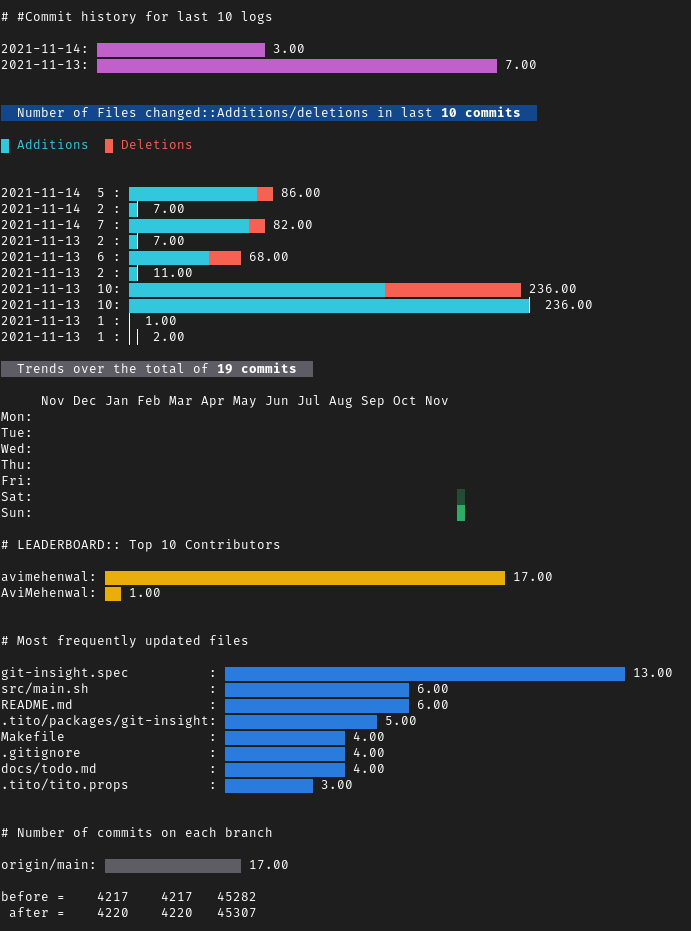

# git-insight

> get browser like colorful insights about a git repository right on your terminal

[Available as RPM package for fedora, centOS and red-hat linux](https://copr.fedorainfracloud.org/coprs/avimehenwal/git-insight/)

              _ _        _           _       _     _
          __ _(_) |_     (_)_ __  ___(_) __ _| |__ | |_
        / _` | | __|____| | '_ \/ __| |/ _` | '_ \| __|
        | (_| | | ||_____| | | | \__ \ | (_| | | | | |_
        \__, |_|\__|    |_|_| |_|___/_|\__, |_| |_|\__|
        |___/                          |___/

[](https://copr.fedorainfracloud.org/coprs/avimehenwal/git-insight/package/git-insight/)

## How to install

```bash
sudo dnf copr enable avimehenwal/git-insight
sudo dnf install git-insight
```

## Usage

```
cd <path/to/a/git/repository>
git-insight
```

## Demo

Analysis of current repo using this tool



## Featured Graphs

- [x] Number of commites on a day
- [x] Number of files changed, Number of changes (+/-) made on commits
- [x] Trend over entire source history
- [x] Top 10 contributors
- [x] Most frequently updated files
- [x] Branch comparison

#### :v: Get in touch with me

> I am looking for Jobs ... :sunglasses:

- [Github](https://github.com/avimehenwal/)
- [My Website](https://avimehenwal.in)
- [My Blog v2](https://avimehenwal2.netlify.app/)
- [Twitter Handle](https://twitter.com/avimehenwal)
- [LinkedIn](https://in.linkedin.com/in/avimehenwal)
- [Stackoverflow](https://stackoverflow.com/users/1915935/avi-mehenwal)

<a href="https://www.buymeacoffee.com/F1j07cV" target="_blank"></a>

Spread Love :hearts: and not :no_entry_sign: hatred [](https://twitter.com/avimehenwal)

1. Number of commites on a day
1. Number of files changed, Number of changes (+/-) made on commits
1. Trend over entire source history
1. Top 10 contributors
1. Most frequently updated files
1. Branch comparison
